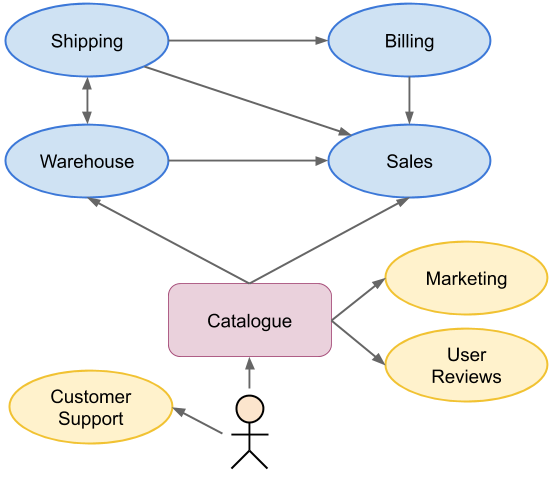
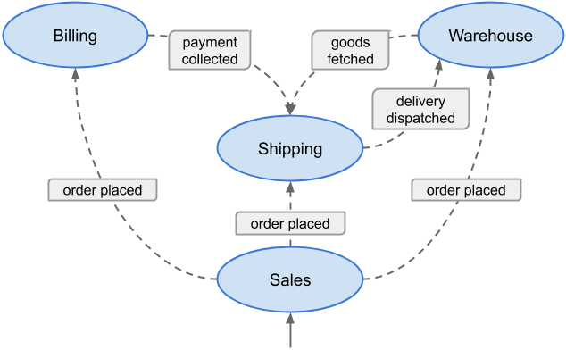

# DDD Example Project in Java: E-Commerce

The purpose of this project is to provide a sample implementation of an e-commerce product following Domain-Driven Design (DDD) and Service-Oriented Architecture (SAO) principles.

Programming language is Java 11 with heavy use of Spring framework.

## Domain Services

Several [business capabilities][1] have been identified:

### Core Domain

- **Sales**
  - put a product for sale
  - categorize a product
  - update a product
  - change a product price
  - validate an order
  - place an order
  
### Supporting Subdomains
  
- **Warehouse**
  - stack goods
  - fetch goods for shipping
  
- **Billing**
  - collect a payment

- **Shipping**
  - dispatch a delivery

Later, we can think about more supporting domains (not implemented in this project):

- **Marketing**
  - discount a product
  - promote a product
  
- **User Reviews**
  - add a product review
  
- **Customer Support**
  - resolve a complain
  - answer a question
  - provide help
  
The e-commerce system is a web application using a **Catalogue** service implementing the [Backends For Frontends (BFF)][2] pattern.

### Services Dependencies

Services cooperate together to work out the business capabilities: products sale and delivery.

### Services Event Workflow

The communication among services is implemented via events:

When the customer places an order the following process starts up (the happy path):

1. Sales service creates a new order and publishes the OrderPlaced event.
2. Billing service collects payment for the order and publishes the PaymentCollected event.
2. Shipping service prepares a delivery.
2. Warehouse service fetches goods from the stock and publishes the GoodsFetched event.
3. Shipping service dispatches the delivery and publishes the DeliveryDispatched event.
4. Warehouse service updates the stock.

[1]: http://bill-poole.blogspot.com/2008/07/value-chain-analysis.html
[2]: https://samnewman.io/patterns/architectural/bff/
